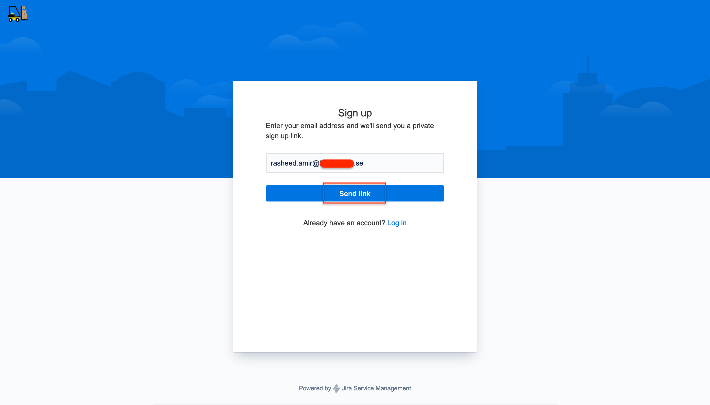
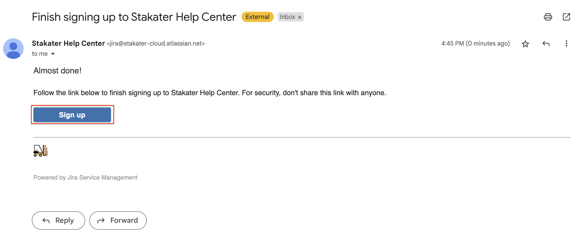
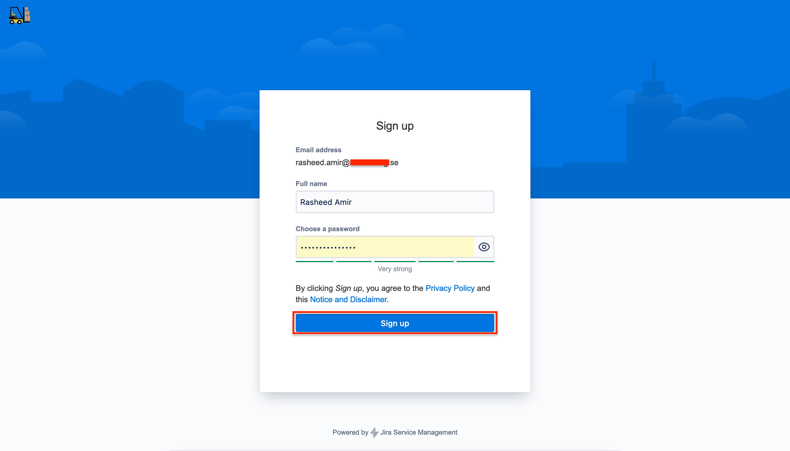

# Getting Support

We provide support to the customers via our [Service Desk Portal](https://stakater-cloud.atlassian.net/servicedesk/customer/portals).

## Sign Up

New users can sign up using their official email address by following this process:

1. Go to the [Service Desk Portal](https://stakater-cloud.atlassian.net/servicedesk/customer/portals)

2. Click on **Sign up**

    

3. Enter your official email address and click **Send link**

    

    You will be then redirected to following page

    

4. Check your email and click **Sign up**

    

5. Provide your full name, strong password and then click **Sign up**

    

## Request Support

As a registered user you can go to the [Service Desk Portal](https://stakater-cloud.atlassian.net/servicedesk/customer/portals) to raise a support request.

## Priorities

The Customer can set the initial priority for a Request by specifying the appropriate priority: `Highest`, `High`, `Medium`, `Low`, or `Lowest`. The Engineer on Duty has the right to adjust it at their own discretion based on the rules below:

Request Priority | Description of the Request Priority
--- | ---
`Highest` | Large-scale failure or complete unavailability of OpenShift or Customer's business application deployed on OpenShift. The `Highest` priority will be lowered to `High` if there is a workaround for the problem. Example: Router availability issues, synthetic monitoring availability issues.
`High` | Partial degradation of OpenShift core functionality or Customer's business application functionality with potential adverse impact on long-term performance. The `High` priority will be lowered to `Medium` if there is a workaround for the problem. Example: Node Group and Control Plane availability problems.
`Medium` | Partial, non-critical loss of functionality of OpenShift or the Customer's business application. This category also includes major bugs in OpenShift that affect some aspects of the Customer's operations and have no known solutions. The `Medium` priority will be lowered to `Low` if there is a workaround for the problem. This priority is assigned to Requests by default. If the Request does not have an priority set by the Customer, it will be assigned the default priority `Medium`. Example: Problems with the monitoring availability and Pod autoscaling.
`Low` | This category includes: Requests for information and other matters, requests regarding extending the functionality of the Kubernetes Platform, performance issues that have no effect on functionality, Kubernetes platform flaws with known solutions or moderate impact on functionality. Example: Issues with extension availability.
`Lowest` | Trivial problem with little or no impact on progress

## Response Times

Stakater guarantees certain reaction and response times for each priority. The reaction time is the maximum time taken for Stakater Support to become aware of the ticket. The response time is the maximum time taken for Stakater Support to make an initial response to the ticket.

Request Priority | Reaction time | Response Time
--- | --- | ---
`Highest` | 5 min | 2 h
`High` | 5 min | 1 day
`Medium` | 5 min | 3 working days
`Low` | 2 working hours | 25 working days
`Lowest` | 4 working hours | 25 working days

## Resolution Time

The time taken to resolve the problem does not include the time required to gain access to the Customer's environment or the data needed to verify and reproduce the problem. The calculation of time resumes as soon as the Customer provides the requested access to the environment or data. The Engineer on Duty has the right to downgrade the priority if the Customer fails to provide access to the environment or data within three hours of the Engineer's request.

## Feedback

Stakater adhere to openness in relations and directness in communications, so feedback is of great importance to us. Please, do not hesitate to share your comments and suggestions with us.

Report any service-related discomfort as a support ticket. Company executives and owners would study it carefully. As a rule, Stakater recommend discussing and solving all problems directly with the Engineer on Duty first since they have the best knowledge of the task at hand and understands the context. However, in extreme situations, you can also contact company executives directly. Please note that in this case, additional time might be required for executives to study the problem and details, thus delaying the resolution of the issue. Still, if you feel there is a justified need to do so, do not hesitate to contact executives.

Stakater commend you for choosing us, and Stakater sincerely hope for mutually beneficial, close, and long-standing cooperation!
