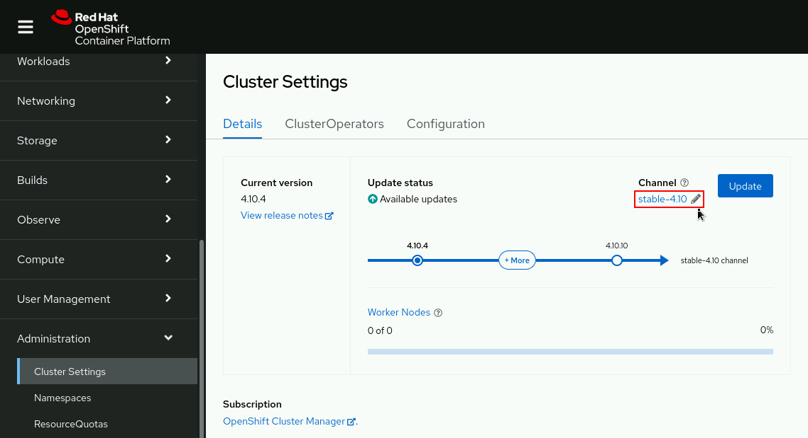
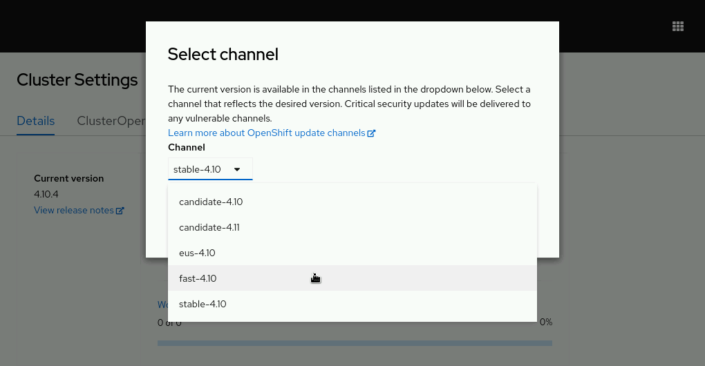
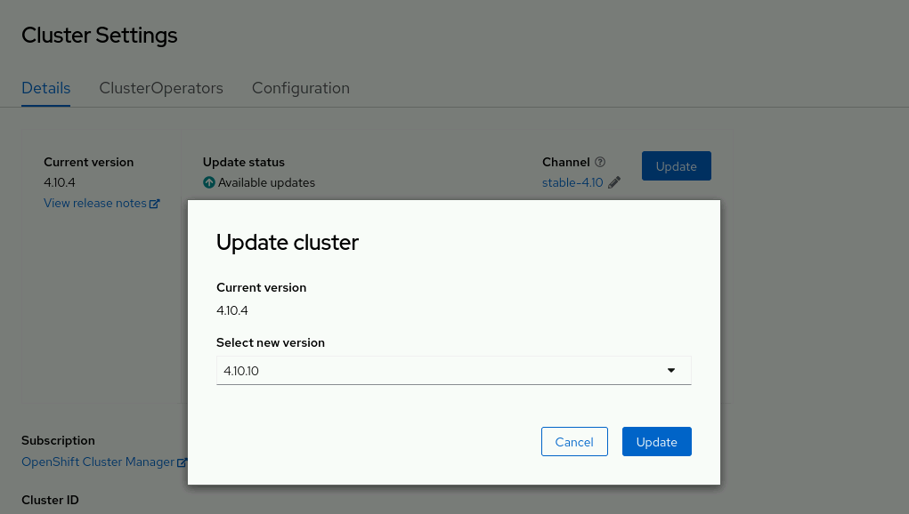

# Cluster Update Process

We can update an OpenShift Container Platform 4 cluster with a single operation by using the web console or the OpenShift CLI (oc).

## Upgrade Channel

With upgrade channels, we can choose an upgrade strategy. Upgrade channels are specific to a minor version of OpenShift Container Platform. Upgrade channels only control release selection and do not impact the version of the cluster that you install.

A channel name consists of three parts: the tier (release candidate, fast, and stable), the major version (4), and the minor version (.2). Example channel names include: stable-4.x, fast-4.x, and candidate-4.x. Each channel delivers patches for a given cluster version.

### Candidate Channel

The candidate channel delivers updates for testing feature acceptance in the next version of OpenShift Container Platform. The release candidate versions are subject to further checks and are promoted to the fast or stable channels when they meet the quality standards.

### Fast Channel

The fast channel delivers updates as soon as they are available. This channel is best suited for development and QA environments. You can use the fast-4.x channel to upgrade from a previous minor version of OpenShift Container Platform.

### Stable Channel

The stable channel contains delayed updates, which means that it delivers only minor updates for a given cluster version and is better suited for production environments.

Red Hat support and site reliability engineering (SRE) teams monitor operational clusters with new fast updates. If operational clusters pass additional testing and validation, updates in the fast channel are enabled in the stable channel.

If Red Hat observes operational issues from a fast channel update, then that update is skipped in the stable channel. The stable channel delay provides time to observe unforeseen problems in actual OpenShift clusters that testing did not reveal.

## Describing Upgrade Paths

The following describes how these upgrade paths would apply to Red Hat OpenShift Container Platform version 4.x:

- When using the stable-4.x channel, you can upgrade your cluster from 4.x.0 to 4.x.1 or 4.x.2. If an issue is discovered     in the 4.x.3 release, then you cannot upgrade to that version. When a patch becomes available in the 4.x.4 release, you can update your cluster to that version.

    This channel is suited for production environments, as the releases in that channel are tested by Red Hat SREs and support services.
- The fast-4.x channel is also supported by Red Hat and can be applied to production environments.

    Administrators must specifically choose a different minor version channel, such as fast-4.11, in order to upgrade to a new release in a new minor version.
- The candidate-4.x channel allows you to install the latest features of OpenShift. With this channel, you can upgrade to all z-stream releases, such as 4.x.1, 4.x.2, 4.x.3, and so on.

    You use this channel to have access to the latest features of the product as they get released. This channel is suited for development and pre-production environments.

The stable and fast channels are classified as General Availability (GA), whereas the candidate channel (release candidate channel) is not supported by Red Hat.

To ensure the stability of the cluster and the proper level of support, we should only switch from a stable channel to a fast channel, and vice versa. Although it is possible to switch from a stable channel or fast channel to a candidate channel, it is not recommended. The candidate channel is best suited for testing feature acceptance and assisting in qualifying the next version of OpenShift Container Platform.

## Changing Update Channel

We can change the update channel to stable-4.x, fast-4.x, or candidate-4.x using the web console or the OpenShift CLI client:

- In the web console, navigate to the `Administration → Cluster Settings` page on the details tab, and then click the pencil icon.



A window displays options to select an update channel.



- Execute the following command to switch to another update channel using the oc client.

```bash
oc adm upgrade channel <channel>
```

For example, to set the channel to fast-4.x:

```bash
oc adm upgrade channel fast-4.x
```

## Prerequisites

- Have access to the cluster as a user with `admin` privileges.

- Have a recent `etcd backup` in case your update fails and you must restore your cluster to a previous state.

- Ensure all Operators previously installed through Operator Lifecycle Manager (OLM) are updated to their latest version in their latest channel. Updating the Operators ensures they have a valid update path when the default OperatorHub catalogs switch from the current minor version to the next during a cluster update.

- Ensure that all machine config pools are running and not paused. Nodes associated with a paused MCP are skipped during the update process.

- Review the list of APIs that were removed in previous Kubernetes version, migrate any affected components to use the new API version, and provide the administrator acknowledgment.

- If you run an Operator or you have configured any application with the pod disruption budget, you might experience an interruption during the upgrade process. If min Available is set to 1 in PodDisruptionBudget, the nodes are drained to apply pending machine configs which might block the eviction process. If several nodes are rebooted, all the pods might run on only one node, and the PodDisruptionBudget field can prevent the node drain.

## Update the Cluster Using the Web Console

We can update the cluster via the web console, or from the command-line. Updating via the web console is easier than using the command-line. The `Administration → Cluster Settings` page displays an `Update Status` of Available updates when a new update is available. From this page, click `Update now` to begin the process:



## Update the Cluster Using the Command Line

The following steps describe the procedure for updating a cluster as a cluster administrator using the command-line interface:

Retrieve the cluster version and review the current update channel information and confirm the channel. If you are running the cluster in production, then ensure that the channel reads stable.

```bash
[user@host ~]$ oc get clusterversion
NAME      VERSION   AVAILABLE   PROGRESSING   SINCE   STATUS
version   4.x.3    True        False         43d     Cluster version is 4.x.3

[user@host ~]$ oc get clusterversion -o jsonpath='{.items[0].spec.channel}{"\n"}'
stable-4.x
```

View the available updates and note the version number of the update that you want to apply.

```bash
[user@host ~]$ oc adm upgrade
Cluster version is 4.x.3

Updates:

VERSION IMAGE
4.x.4   quay.io/openshift-release-dev/ocp-release@sha256:...
...output omitted...
```

Apply the latest update to your cluster or update to a specific version:
Run the following command to install the latest available update for your cluster.

```bash
[user@host ~]$ oc adm upgrade --to-latest=true
```

Run the following command to install a specific version. VERSION corresponds to one of the available versions that the `oc adm upgrade` command returns.

```bash
[user@host ~]$ oc adm upgrade --to=VERSION
```

The previous command initializes the update process. Run the following command to review the status of the Cluster Version Operator (CVO) and the installed cluster operators.

```bash
[user@host ~]$ oc get clusterversion
NAME     VERSION  AVAILABLE  PROGRESSING  SINCE  STATUS
version  4.x.3   True       True         30m    Working towards 4.x.4 ...

[user@host ~]$ oc get clusteroperators
NAME                  VERSION   AVAILABLE   PROGRESSING   DEGRADED
authentication        4.x.3    True        False         False
cloud-credential      4.x.4    False       True          False
openshift-apiserver   4.x.4    True        False         True
...output omitted...
```

The following command allows you to review the cluster version status history to monitor the status of the update. It might take some time for all the objects to finish updating.

The history contains a list of the most recent versions applied to the cluster. This value is updated when the CVO applies an update. The list is ordered by date, where the newest update is first in the list.

If the roll-out completed successfully, updates in the history have a state of Completed. Otherwise, the update has a state of Partial if the update failed or did not complete.

```bash
[user@host ~]$ oc describe clusterversion
...output omitted...
  History:
    Completion Time:    2022-04-28T04:38:12Z
    Image:              quay.io/openshift-release-dev/ocp-release@sha256:...
    Started Time:       2022-04-28T03:35:05Z
    State:              Partial
    Verified:           true
    Version:            4.x.4
    Completion Time:    2022-03-15T12:39:02Z
    Image:              quay.io/openshift-release-dev/ocp-release@sha256:...
    Started Time:       2022-03-15T12:23:14Z
    State:              Completed
    Verified:           false
    Version:            4.x.3
```

After the process completes, you can confirm that the cluster has been updated to the new version.

```bash
[user@host ~]$ oc get clusterversion
NAME     VERSION  AVAILABLE  PROGRESSING  SINCE  STATUS
version  4.x.4   True       True         30m    Cluster version is 4.x.4
```
