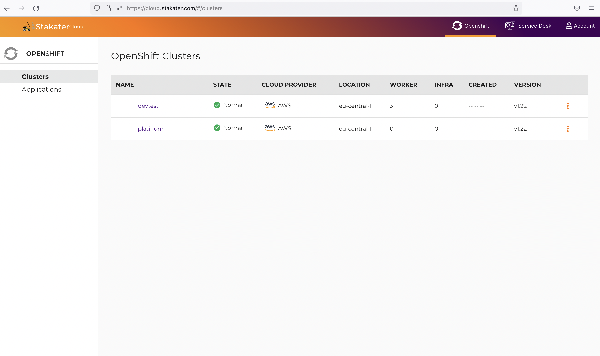
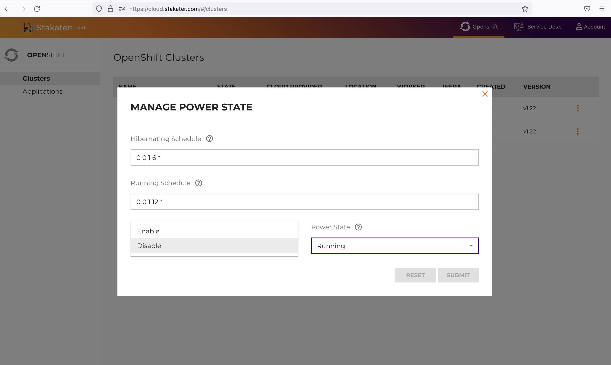
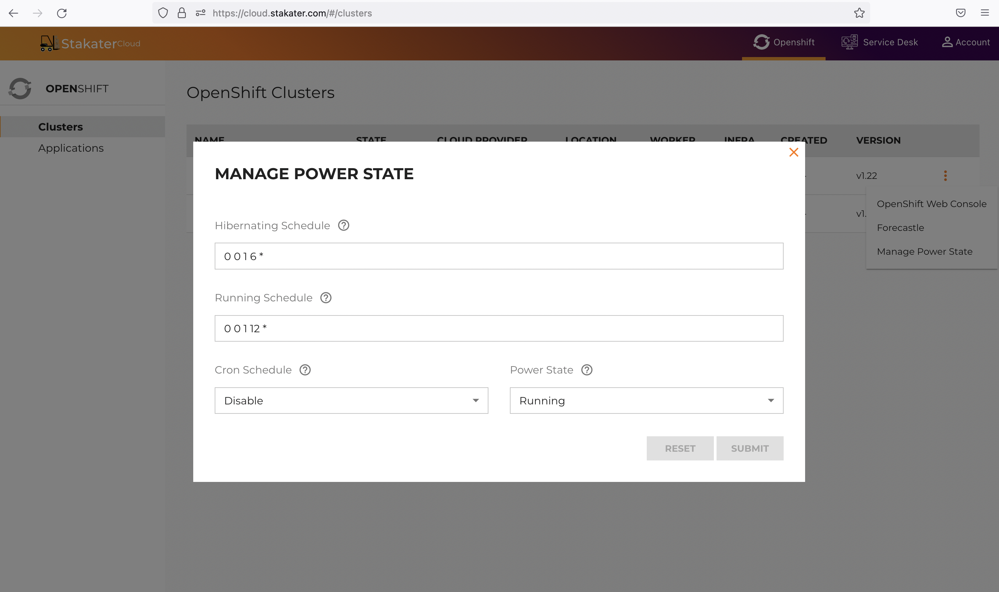

# Hibernating your Cluster

For clusters running non-critical workloads, e.g. test, development or those only utilized during business hours, it is possible to schedule Cluster Hibernation to save on cloud costs, where Pay-as-you-go cloud computing (PAYG cloud computing) model is implemented.

Cluster Hibernation automatically powers your cluster nodes (including master nodes) up or down according to your defined cron schedule.

It takes around 1-3 minutes to take your cluster offline and about 3-5 minutes to power back up depending on your cloud provider.

## Schedule Hibernation for your cluster

You can schedule a hibernation window for non-critical workload clusters using cron jobs from your web console.

To configure a Hibernation Schedule, go to your Cluster Management page where you can view all your managed clusters.

Click on the menu button beside the cluster for which you wish to set a hibernation window and select Manage `Power State`.

**Hibernating Schedule** accepts a cron expression which specifies when to power your cluster down. E.g a cron expression of “0 20 ** *” will power your cluster down at 8pm  every day.

**Running Schedule** accepts a cron expression which specifies when to power  your cluster up. E.g a cron expression of “0 8 ** *” will power your cluster up at 8am every day.

**cron Schedule** allows you to enable or disable a cron schedule.

**Power State** allows you to manually select a Power State for your cluster. You can set it to Running or Hibernation.

Setting your Power State to Hibernation will immediately power your cluster down, while Running will bring back your cluster online.

Now that you have implemented your hibernation schedule, your cluster will be offline during cluster hibernation, helping you save on cloud costs for your cluster nodes.
