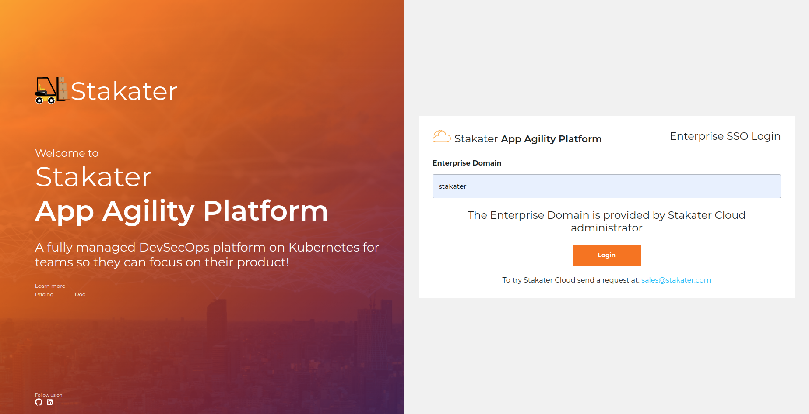
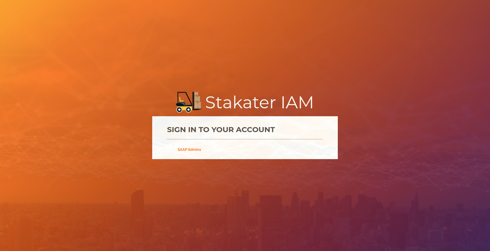

# Access Your Cluster

Lets see how will you access your cluster.

1. Access your cluster by going to [Stakater App Agility Platform](https://cloud.stakater.com/). Enter your enterprise domain provide by Stakater Cloud administrator.

    

1. Log In with the method configured for your Organization.

    

1. Once you've logged in, you ll be directed to similar cluster overview page.

    

1. Click on drop down toggle for the relevant cluster:

    1. Select `OpenShift Web Console` to open the OpenShift Web Console.

        

        > You should belong to a Tenant

    1. Select Forecastle for view services available on the cluster.

        

## Setting up CLI

Following CLI tools are required for working with Stakater App Agility Platform.

- [OpenShift CLI (oc)](https://docs.openshift.com/container-platform/4.12/cli_reference/openshift_cli/getting-started-cli.html#installing-openshift-cli) With the OpenShift command-line interface (CLI), the oc command, you can create applications and manage OpenShift Container Platform projects from a terminal.

- [kubectl](https://kubernetes.io/docs/tasks/tools/) The Kubernetes command-line tool, kubectl, allows you to run commands against Kubernetes clusters. You can use kubectl to deploy applications, inspect and manage cluster resources, and view logs.

- [Helm](https://helm.sh/docs/intro/install/) Helm helps you manage Kubernetes applications — Helm Charts help you define, install, and upgrade even the most complex Kubernetes application.
