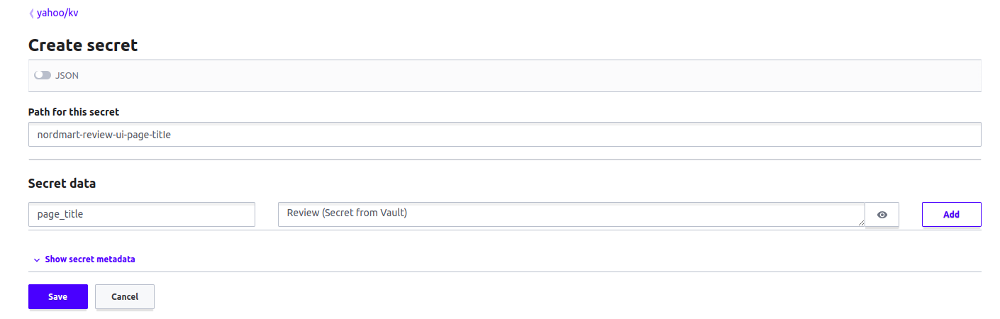
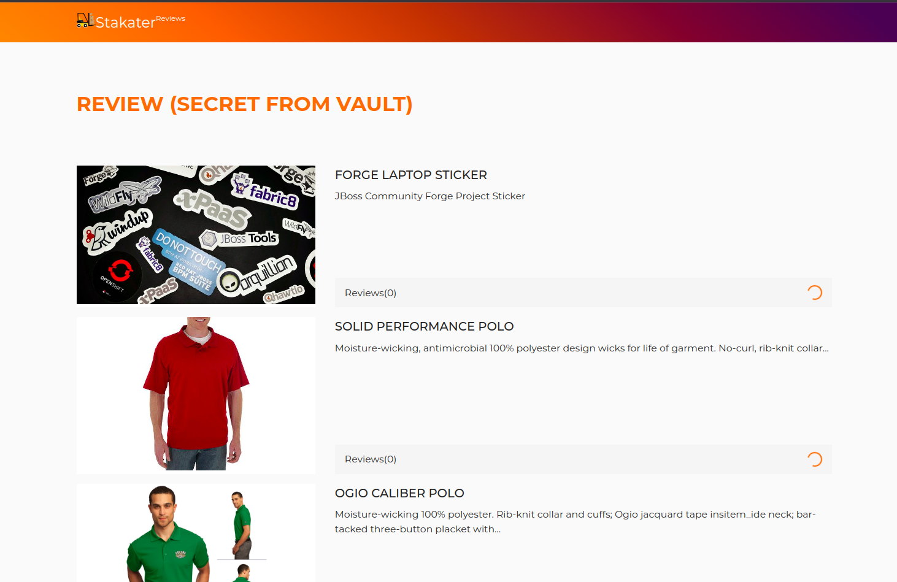

# Adding Secrets

Now, we will set up applications to use consume secrets from Vault, using ExternalSecrets.

Multi-Tenant Operator [MTO] creates a path for each tenant in the Vault.
Each user in the cluster is part of a tenant.
Users have access to the path corresponding to their tenant.
In this path, a key/value pair can be stored, and/or another path containing key/value pair can exist.

Login to Vault to view your tenant path.

- Access Vault from  [Forecastle](https://forecastle-stakater-forecastle.apps.devtest.vxdqgl7u.kubeapp.cloud) console, search `Vault` and open the `Vault` tile.

    
- From the drop-down menu under `Method`, select `OIDC` and click on `Sign in with OIDC Provider` and select `workshop` identity Provider

    

- You will be brought to the `Vault` console. You should see the key/value path for your tenant.
- External Secrets Operator is used to fetch secret data from Vault, and create Kubernetes secret in the cluster.
- External Secrets Operator uses SecretStore to make a connection to the Vault.
- SecretStore uses ServiceAccount with Vault label to access Vault.
- SecretStore and ServiceAccount is created in each tenant namespace.
- Each ExternalSecret CR contains reference to SecretStore to be used.

Stakater Application Chart contains support for ExternalSecret.

"```"
externalSecret:
  enabled: true

  #SecretStore defines which SecretStore to use when fetching the secret data
  secretStore:
    name: example-secret-store
    kind: SecretStore # or ClusterSecretStore  

  #RefreshInterval is the amount of time before the values reading again from the SecretStore provider
  `refreshInterval`: "1m"
  files:
    secret-1-name:
      #Data defines the connection between the Kubernetes Secret keys and the Provider data
      data:
        example-secret-key:
          `remoteRef`:
            key: example-provider-key
            property: example-provider-key-property

    secret-2-name:
      #Used to fetch all properties from the Provider key
      dataFrom:
        key: example-provider-key
      type: Opaque
      annotations:
        key: value
      labels:
        key: value
"```"
From the above configuration, a Kubernetes secret is created.

Let's add a sample secret for Stakater Nordmart Review UI application for demo.

- In the path of your tenant, Click `Create Secret`, add path of secret, and add key/value pair as shown below.

    - Path for secret: `nordmart-review-ui-page-title`
    - Secret key: `page_title`
    - Secret value: Review (Secret from Vault)



- Open `stakater-nordmart-review-ui` project, and navigate to deploy folder
- In `values.yaml` file, add the following YAML for external secret:

"```"
  externalSecret:
    enabled: true
    secretStore:
      name: tenant-vault-secret-store
    refreshInterval: "1m"
    files:
      review-ui-secret:
        dataFrom:
        - key: review-ui/dev/nordmart-review-ui-page-title
"```"

- Once the updated secret is created, application pod will be recreated. Refresh the application route to see the change. The title will be updated!



For more information on ExternalSecrets, see [External Secrets documentation](https://external-secrets.io/v0.8.1/introduction/overview/)
