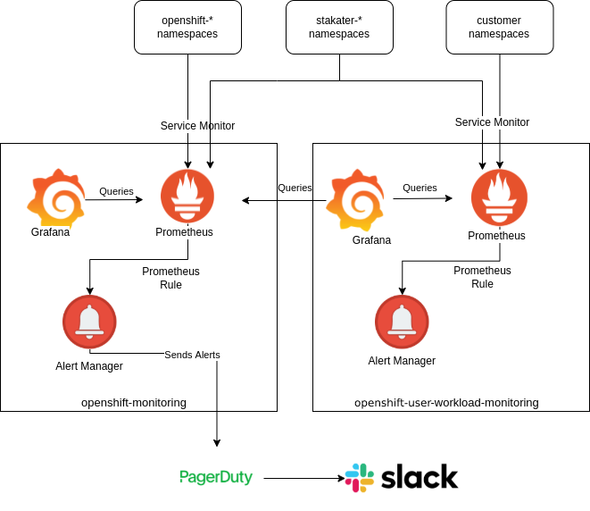

# Creating Application Alerts

## Overview

There are 2 types of monitoring:

1. Infrastructure monitoring (comes default with OpenShift installation)
2. User Workload monitoring (it can be enabled)



## Enabling monitoring for user-defined projects

Cluster administrators can enable monitoring for user-defined projects by setting the `enableUserWorkload: true` field in the cluster monitoring ConfigMap object.

```yaml
apiVersion: v1
kind: ConfigMap
metadata:
  name: cluster-monitoring-config
  namespace: openshift-monitoring
data:
  config.yaml: |
    enableUserWorkload: true 
```

## Excluding a user-defined project from monitoring

Individual user-defined projects can be excluded from user workload monitoring. To do so, simply add the `openshift.io/user-monitoring` label to the project’s namespace with a value of false.

Add the label to the project namespace:

```bash
oc label namespace my-project 'openshift.io/user-monitoring=false'
```

## Infrastructure Monitoring

1. Prometheus
2. Grafana
3. Alertmanager

## User Workload Monitoring

1. Prometheus
2. Grafana
3. Alertmanager

## Creating Application Alerts to Monitor Application workloads

In order to define Prometheus rules to monitor applications on the basis of exposed metrics. You need 3 things:

1. Metrics Exposed by Application endpoints
2. Metrics endpoints are scraped via ServiceMonitor by Prometheus
3. Defining PrometheusRule CustomResource

### Metrics Exposed by the Application

Prometheus metrics can be exposed on any endpoint from the application (usually `/metrics`)

### Metrics endpoints are scraped via ServiceMonitor by Prometheus

The Prometheus Operator includes a Custom Resource Definition that allows the definition of the ServiceMonitor. The ServiceMonitor is used to define an application you wish to scrape metrics from, the controller will action the ServiceMonitors we define and automatically build the required Prometheus configuration.

Example ServiceMonitor:

```yaml
apiVersion: monitoring.coreos.com/v1
kind: ServiceMonitor
metadata:
  name: example-svc-monitor
  namespace: example-namespace
spec:
  endpoints:
  - interval: 30s
    path: /metrics
    port: metrics
  selector:
    matchLabels:
      app: example-svc-label
```

### Creating alerting rules for user-defined projects

Creating alerting rules for user-defined projects
You can create alerting rules for user-defined projects. Those alerting rules will fire alerts based on the values of chosen metrics.

```yaml
apiVersion: monitoring.coreos.com/v1
kind: PrometheusRule
metadata:
  name: example-alert
  namespace: ns1
spec:
  groups:
  - name: example
    rules:
    - alert: VersionAlert
      expr: version{job="prometheus-example-app"} == 0
```
